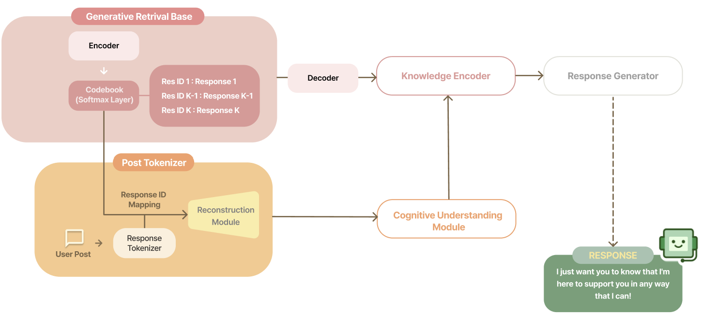

# Generative Retrieval-Enhanced Emotional Supportive Conversation

## Abstract

Emotional Support Conversation (ESC) provides empathetic interactions and proactive solutions to assist users through negative emotional states. Existing retrieval-enhanced models, which are based on Dense Passage Retrieval (DPR) have demonstrated improvements over numerous state-of-the-art models by enhancing the understanding of correlative past situations. However, DPR approaches face challenges in reducing the semantic mismatch between retrieved cases and the current dialogue context. When the retrieved response does not fully align with the context, existing methods often fail to provide supplementary strategies or dynamic adjustments needed to effectively bridge the gap. DPR operates by calculating vector similarities within a fixed embedding space to identify the top-$s$ passages with the highest relevance as candidate responses. DPR struggles to dynamically reflect the evolving emotional context or strategic needs of the user as the dialogue progresses. To tackle this issue, we propose integrating Generative Retrieval (GR) into ESC systems. GR combines the retrieval and generation processes into one unified framework, which not only returns the retrieved responses but also adjusts dynamically to shifts in emotional and cognitive contexts. To address this, we redefine the response ID by integrating the document ID from previous studies. Our experiments demonstrate that the proposed architecture outperforms various baselines. 

## GreenConv

Our code mainly references two papers.

### D^2RCU 

paper: https://arxiv.org/abs/2404.02505

code: https://github.com/Bat-Reality/DDRCU/tree/main

### GenRet

paper: https://papers.nips.cc/paper_files/paper/2023/hash/91228b942a4528cdae031c1b68b127e8-Abstract-Conference.html

code: https://github.com/sunnweiwei/GenRet?tab=readme-ov-file

## Notice

This code is still a work in progress.

We plan to upload an end-to-end model that integrates GenRet and BlenderBot in the future.

The currently uploaded code is for informational purposes only.